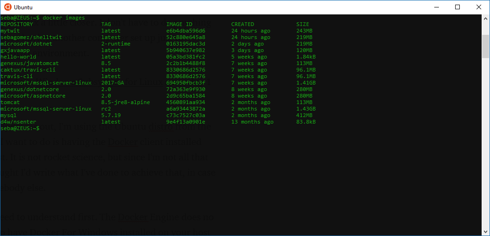
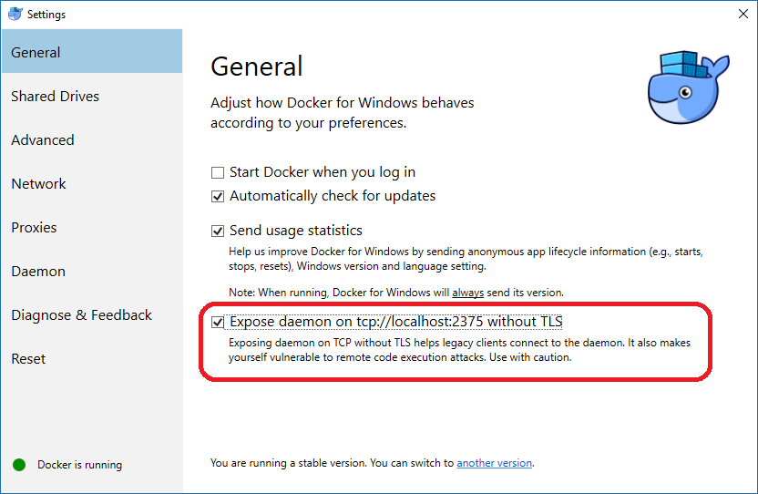

# Installing the Docker client on Windows Subsystem for Linux (Ubuntu)



## Something to understand before you start


Docker does not run WSL, Docker for Windows has to be installed on your machine first. At the end of this document you will have a Docker client running on Linux (WSL) sending commands to your Docker Engine daemon installed on Windows.


## Prerequisites


* <a href="https://docs.microsoft.com/en-us/windows/wsl/install-win10">Ubuntu Subsystem</a>
* <a href="https://www.docker.com/docker-windows">Docker for Windows</a>

Once Docker for Windows has installed, make sure to expose the daemon on Windows.



## Installation


1 - Update the apt package index:

```
$ sudo apt-get update
```

2 -  Install packages to allow apt to use a repository over HTTPS:

```
$ sudo apt-get install \
 apt-transport-https \
 ca-certificates \
 curl \
 software-properties-common
```

 3 - Add Docker’s official GPG key:

```
 $ curl -fsSL https://download.docker.com/linux/ubuntu/gpg | sudo apt-key add
```

 4 -  Verify that you now have the key with the fingerprint 9DC8 5822 9FC7 DD38 854A E2D8 8D81 803C 0EBF CD88, by searching for the last 8 characters of the fingerprint.

```
 $ sudo apt-key fingerprint 0EBFCD88
```

 You should get the following response:

 pub 4096R/0EBFCD88 2017–02–22
 Key fingerprint = 9DC8 5822 9FC7 DD38 854A E2D8 8D81 803C 0EBF CD88
uid Docker Release (CE deb) <docker@docker.com>
sub 4096R/F273FCD8 2017–02–22

5 - Use the following command to set up the stable repository. You always need the stable repository, even if you want to install builds from the edge or test repositories as well. To add the edge or test repository, add the word edge or test (or both) after the word stable in the commands below.

```
$ sudo add-apt-repository \
   "deb [arch=amd64] https://download.docker.com/linux/ubuntu \
   $(lsb_release -cs) \
   stable"
```

##### Now you can install Docker Community Addition

6 - Update the apt package index again

```
$ sudo apt-get update
```

7 - And install Docker CE

```
$ sudo apt-get install docker-ce
```
----
Once that is finished you will have everything installed in Linux. As mentioned before, the Docker Engine does not run in WSL.

So if you write a command like docker images, you will receive a message like this.

>Cannot connect to the Docker daemon at unix:///var/run/docker.sock. Is the docker daemon running?

Reality is that it is not running a will not be for now.

You need to tell the Docker client where the Docker host is, and you can do that by using the -H option as follows:

```
$ docker -H localhost:2375 images
```
If you don't want to type the host every time, you can set up and environment variable called DOCKER_HOST to localhost:2375
```
$ export DOCKER_HOST=localhost:2375
```
Now you can run ```docker images``` to see images in your host environment.

Unfortunately, this environment variable will only last as long as the current session. You would have to set it every time you open bash. To avoid this, you would need to set a variable in .bash_profile in your home directory.

```
$ echo “export DOCKER_HOST=localhost:2375” >> ~/.bash_profile
```

Restart the bash console and the DOCKER_HOST variable should be there, just type ```docker images``` to check.

One thing that happened to me was that after restart my aliases stopped working. Quick fix was to edit the .bash_profile and add the following.

```
echo “source $HOME/.bashrc” >> ~/.bash_profile
```

Enjoy!

Reference: <a href="https://docs.docker.com/install/linux/docker-ce/ubuntu/">Get Docker CE for Ubuntu</a>
